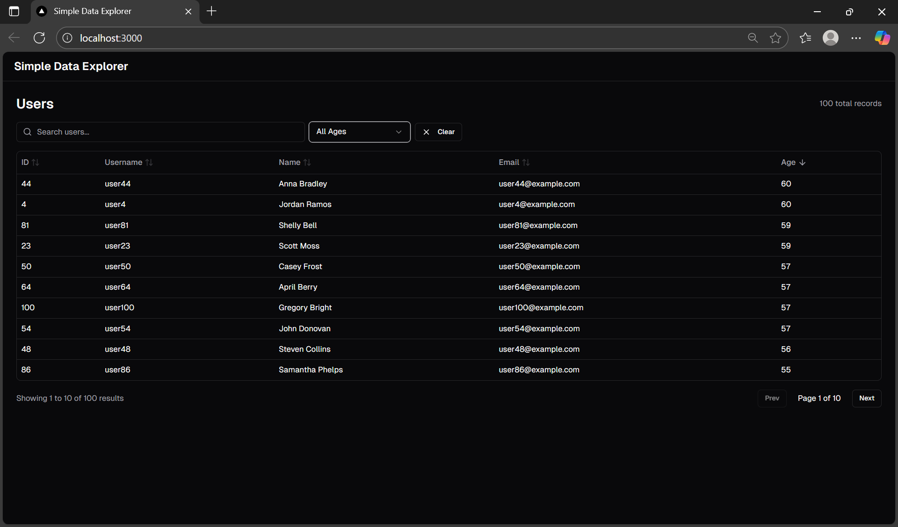

# Simple Data Explorer



A full-stack project using **Next.js** for the frontend, **FastAPI** for the backend, and **PostgreSQL** as the database.   Docker is used for easy setup and consistent development environment.

---

## Repository Structure

```

simple-data-explorer/
│
├─ api/                    # Backend FastAPI
│  ├─ **init**.py
│  ├─ index.py             # main FastAPI app
│  ├─ models/
│  │  └─ user.py
│  ├─ routers/
│  │  └─ users.py
│  ├─ db.py
│  └─ seed.py
│
├─ app/               # Next.js frontend
│  ├─ pages.tsx
│  ├─ global.css
│  └─ layout.tsx
│
├─ components/              
│  ├─ navbar.tsx
│  ├─ ui/
│     └─ button.tsx
│     └─ input.tsx
│     └─ select.tsx
│     └─ table.tsx
│                
├─ Dockerfile              # Docker configuration
├─ docker-compose.yml
│
├─ requirements.txt        # Python dependencies
├─ package.json            # Node dependencies
└─ README.md

````

---

## Setup Instructions

1. **Clone the repository**

```bash
git clone https://github.com/debrinashika/Simple-Data-Explorer.git
cd Simple-Data-Explorer
````

2. **Build and run Docker containers**

```bash
docker-compose up --build
```

3. **Access applications**

* Frontend: [http://localhost:3000](http://localhost:3000)
* Backend (FastAPI Swagger UI): [http://localhost:8000/docs](http://localhost:8000/docs)

4. **Seed database (if needed)**

```bash
docker-compose run --rm seed
```

---

## Approach

* **Backend**: FastAPI with SQLAlchemy ORM + PostgreSQL. Seed script initializes dummy data.
* **Frontend**: Next.js app fetching data from FastAPI using environment variable `NEXT_PUBLIC_FASTAPI_URL`.
* **Docker**: Multi-stage build for production-ready Next.js, separate container for FastAPI, and PostgreSQL with persistent volume.

---

## Improvements 

If I had more time:

* Pagination, filtering, and sorting in frontend UI.
* Unit tests for backend endpoints.

